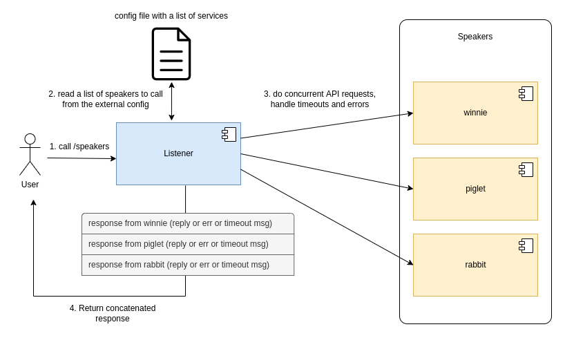

# Kuberneters-native Golang web application with concurrency

## Idea

Listener is a web server that could send client requests to many speakers. Being called at `/speakers` endpoint, it collects the replies from all speakers listed in deployment/listener-config.yaml and returns their concatenation.



## Dockerization

Side note: distroless 9.94 MB vs ubi 241 MB
```
$ podman images | grep webapp
quay.io/tkrishtop/webapp                                           distroless                                b8e1f29ab611  10 seconds ago  9.94 MB
quay.io/tkrishtop/webapp                                           ubi                                       a797dc42dbb5  17 minutes ago  241 MB
```

Build speaker image

```
$ podman build -f Dockerfile_speaker -t quay.io/tkrishtop/webapp:speaker .
$ podman run --rm -p 3000:3000 -d --name webapp -t quay.io/tkrishtop/webapp:speaker
$ curl localhost:3000
[unknown] said: UnknownSpeech
$ podman push quay.io/tkrishtop/webapp:speaker
```

Build listener image

```
$ podman build -f Dockerfile_listener -t quay.io/tkrishtop/webapp:listener .
$ podman push quay.io/tkrishtop/webapp:listener
```

## Deployment on k8s

For the reference: [Install minikube on Fedora36](https://www.tutorialworks.com/kubernetes-fedora-dev-setup/).

```
$ minikube start --driver=kvm2

$ kubectl apply -f deployment/speaker-config.yaml
configmap/speaker-config created

$ kubectl apply -f deployment/speaker-winnie.yaml 
deployment.apps/winnie-deployment created
service/winnie-service created
$ kubectl apply -f deployment/speaker-piglet.yaml 
deployment.apps/piglet-deployment created
service/piglet-service created

$ kubectl get pod
NAME                                 READY   STATUS    RESTARTS   AGE
piglet-deployment-7fd7dc4689-8t4m9   1/1     Running   0          11s
winnie-deployment-b75885d67-2s6hh    1/1     Running   0          16s

$ kubectl logs -l app=speaker
2022/10/04 10:43:33 piglet is active
2022/10/04 10:43:30 winnie is active

$ kubectl apply -f deployment/listener-config.yaml 
configmap/listener-config created
$ kubectl apply -f deployment/listener.yaml 
deployment.apps/listener-deployment created
service/listener-service created

$ kubectl logs -l app=listener
2022/10/04 10:45:25 Listener is active

$ kubectl get svc
NAME               TYPE        CLUSTER-IP       EXTERNAL-IP   PORT(S)          AGE
kubernetes         ClusterIP   10.96.0.1        <none>        443/TCP          2m53s
listener-service   NodePort    10.108.218.193   <none>        3003:30103/TCP   31s
piglet-service     NodePort    10.105.89.198    <none>        3002:30102/TCP   2m20s
winnie-service     NodePort    10.103.46.135    <none>        3000:30100/TCP   2m25s

# there is a delay 10s for piglet to reply
# the timeout is 2s --> piglet will timeout
$ curl $(minikube ip):30103/speakers
Concatenated replies: 
[winnie] said: Hallo, Rabbit, isn't that you? 
Deadline exceeded for url: http://piglet-service:3002 

$ kubectl logs -l app=listener -f
2022/10/14 21:56:24 Reading config file:  /config/speakers-config.yaml
2022/10/14 21:56:24 Unmarchalling configuration
2022/10/14 21:56:24 Listener is active
2022/10/14 21:57:14 List of speakers to call:  [{winnie winnie-service :3000} {piglet piglet-service :3002}]
2022/10/14 21:57:14 Calling speaker winnie
2022/10/14 21:57:14 Calling speaker piglet
2022/10/14 21:57:14 Calling URL: http://piglet-service:3002
2022/10/14 21:57:14 Calling URL: http://winnie-service:3000
2022/10/14 21:57:14 Received reply for url:  http://winnie-service:3000
2022/10/14 21:57:16 Deadline exceeded for url: http://piglet-service:3002

# let's set a delay for piglet to reply in 1s
$ kubectl delete configmaps speaker-config
configmap "speaker-config" deleted
$ kubectl delete svc piglet-service
service "piglet-service" deleted
$ kubectl delete deploy piglet-deployment
deployment.apps "piglet-deployment" deleted
$ kubectl apply -f deployment/speaker-config.yaml configmap/speaker-config created
$ kubectl apply -f deployment/speaker-piglet.yaml deployment.apps/piglet-deployment created
service/piglet-service created

# now the piglet's delay to reply is 1s
# the timeout is 2s --> piglet will _not_ timeout
# we didn't restart winnie after changing the configmap --> error
$ curl $(minikube ip):30103/speakers
Concatenated replies:
[winnie] said: Hallo, Rabbit, isn't that you?
Deadline exceeded for url: http://piglet-service:3002

$ curl $(minikube ip):30103/speakers
Concatenated replies: 
Error while calling url http://winnie-service:3000: Get "http://winnie-service:3000": dial tcp 10.104.79.9:3000: connect: connection refused
[piglet] said: Isn't that Rabbit's voice?

$ kubectl logs -l app=listener -f
2022/10/14 22:06:36 List of speakers to call:  [{winnie winnie-service :3000} {piglet piglet-service :3002}]
2022/10/14 22:06:36 Calling speaker winnie
2022/10/14 22:06:36 Calling speaker piglet
2022/10/14 22:06:36 Calling URL: http://piglet-service:3002
2022/10/14 22:06:36 Calling URL: http://winnie-service:3000
2022/10/14 22:06:36 Received reply for url:  http://winnie-service:3000
2022/10/14 22:06:37 Received reply for url:  http://piglet-service:3002

# restarted winnie now
$ curl $(minikube ip):30103/speakers
Concatenated replies: 
[winnie] said: Hallo, Rabbit, isn't that you?
[piglet] said: Isn't that Rabbit's voice?

$ kubectl logs -l app=listener -f
2022/10/14 22:09:36 List of speakers to call:  [{winnie winnie-service :3000} {piglet piglet-service :3002}]
2022/10/14 22:09:36 Calling speaker winnie
2022/10/14 22:09:36 Calling speaker piglet
2022/10/14 22:09:36 Calling URL: http://piglet-service:3002
2022/10/14 22:09:36 Calling URL: http://winnie-service:3000
2022/10/14 22:09:36 Received reply for url:  http://winnie-service:3000
2022/10/14 22:09:37 Received reply for url:  http://piglet-service:3002
```
